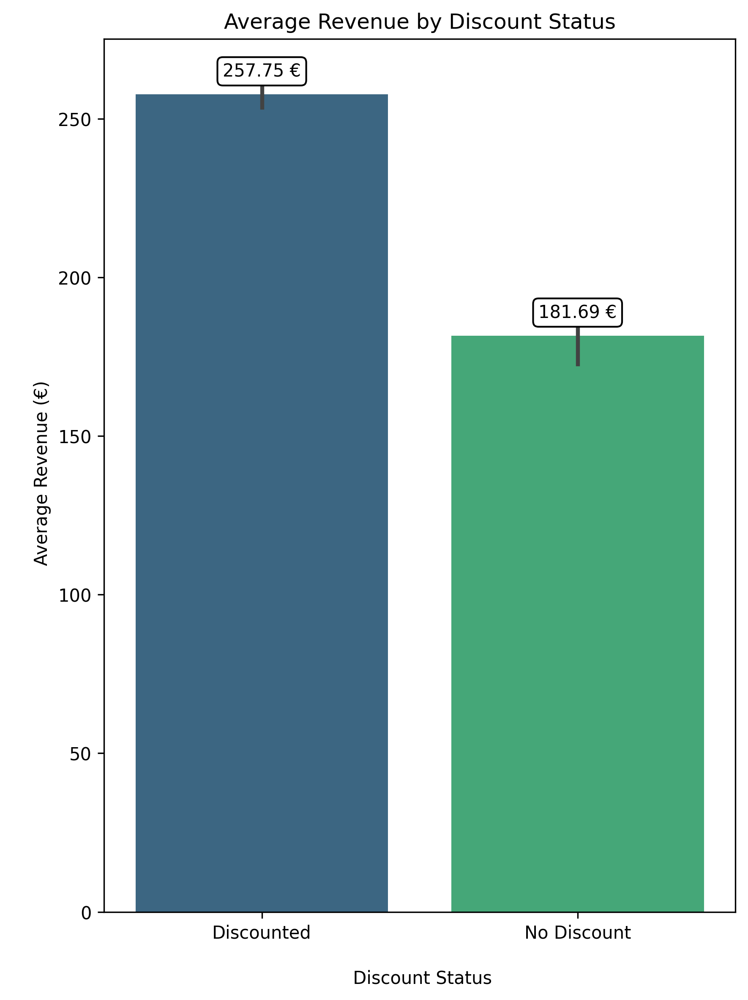
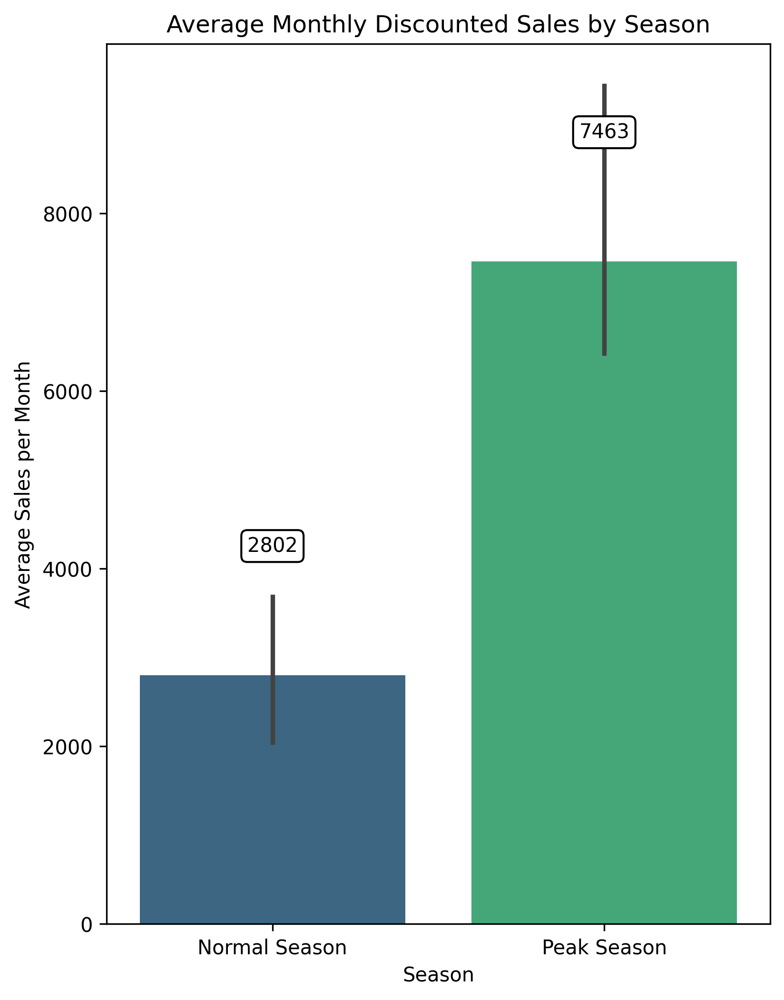
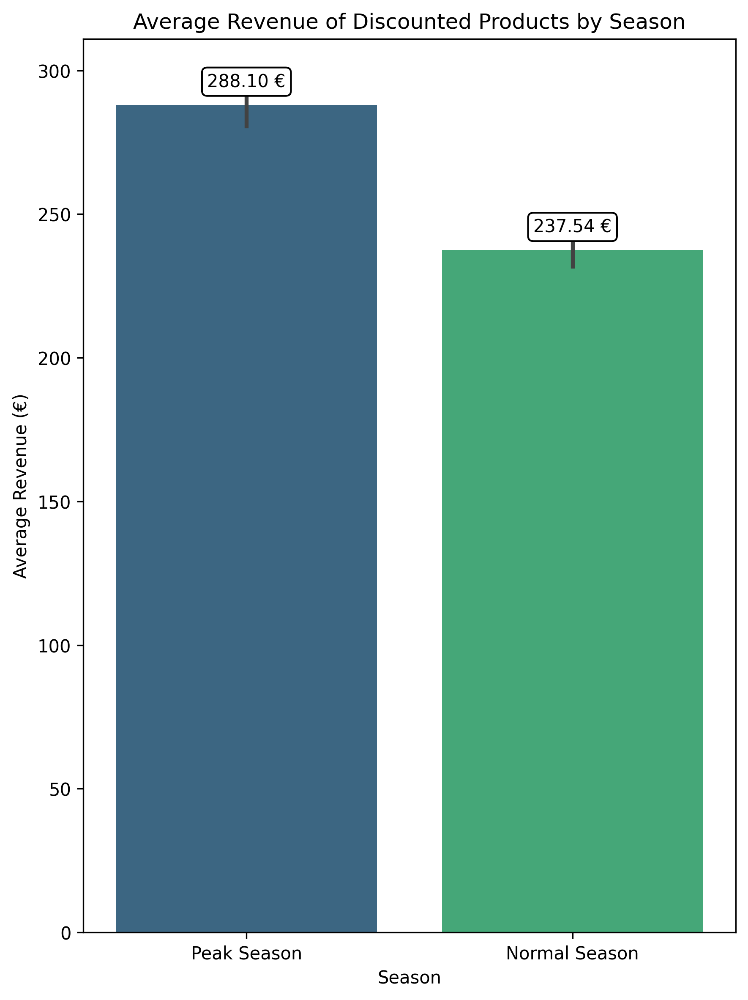
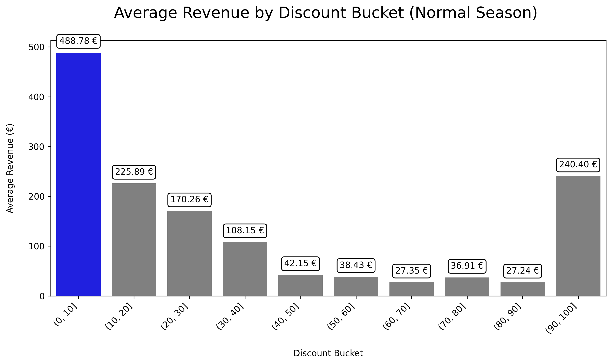
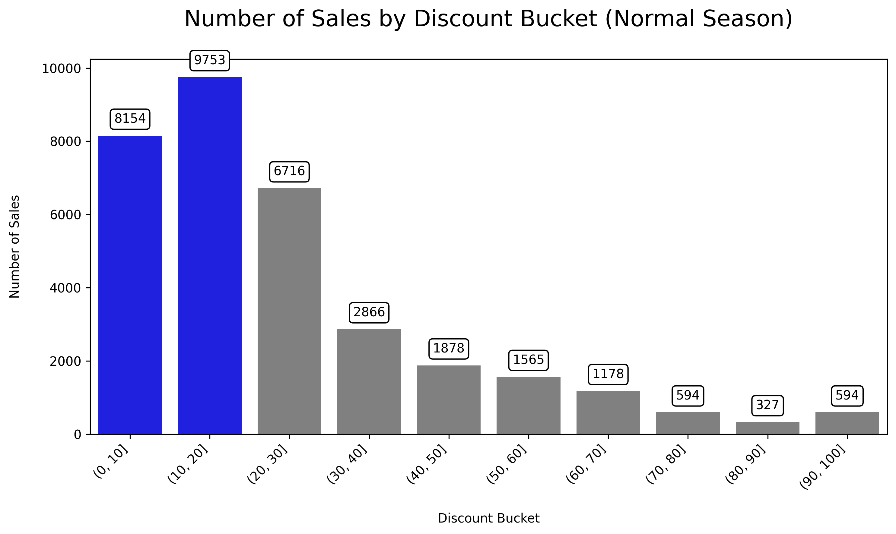
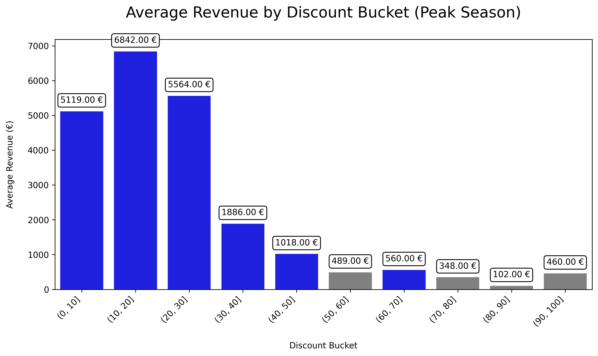
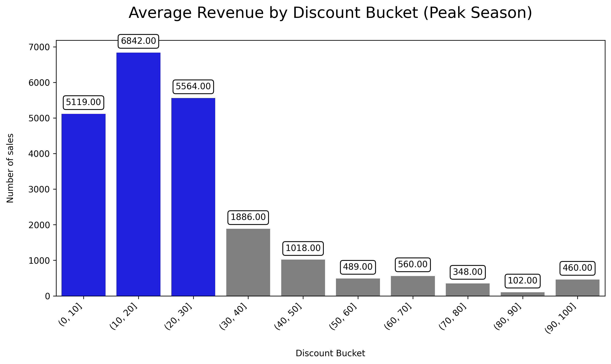
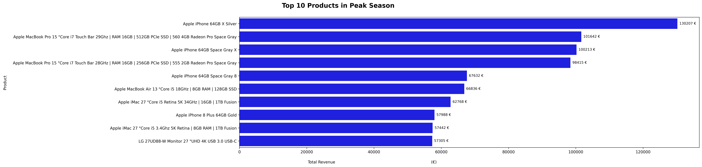

# E-Commerce Discount Strategy Analysis

<p align="center">


</p>

<p align="center">

<a href="https://github.com/Shahla-analyst/eniac-discount-strategy-analysis/blob/main/notebook/04_Business_Analysis.ipynb">

</a>

<a href="https://github.com/Shahla-analyst/eniac-discount-strategy-analysis/blob/main/presentation/Die_Rabattstrategie_von_ENIAC.pptx">

</a>

</p>

---

# Project Overview

This project analyzes the impact of discount strategies on sales performance in an e-commerce environment. The analysis focuses on understanding how different discount levels influence revenue, sales volume, and customer purchasing behavior during both **Normal Season** and **Peak Season**.

The project analyzes sales data from **Eniac** as part of a collaborative data analytics training project.

The objective is to explore discount strategies and generate actionable business insights based on the available dataset.

The project demonstrates an end-to-end data analytics workflow, starting with raw data cleaning and quality assessment and continuing through product categorization, exploratory analysis, visualization, and business recommendations.

---

# Business Problem

E-commerce companies frequently use discounts to increase sales. However, excessive discounts may reduce profitability, while insufficient discounts may fail to stimulate customer demand.

The main business challenge is therefore to identify a discount strategy that balances:

- Revenue growth
- Sales volume
- Customer demand
- Business profitability

This project investigates which discount levels provide the strongest business outcomes and whether customer purchasing behavior changes between Normal Season and Peak Season.

---

# Business Objectives

The analysis addresses the following business questions:

- How do discounts affect revenue?
- Which discount levels perform best?
- Does Peak Season change customer purchasing behavior?
- Which products generate the highest revenue?
- Which discount strategy should an e-commerce company adopt?

---

# Key Findings

The analysis revealed several important insights:

- Moderate discounts achieved a strong balance between revenue and sales volume.
- Peak Season generated substantially higher sales activity than Normal Season.
- Higher discounts did not always lead to higher revenue.
- Customer purchasing behavior differed between Peak Season and Normal Season.
- Structured data cleaning and quality assessment improved the reliability of the analysis.

---

# Project Workflow

The project followed an end-to-end data analytics workflow:

```text
Raw Data
    │
    ▼
Data Cleaning
    │
    ▼
Data Quality Assessment
    │
    ▼
Product Categorization
    │
    ▼
Business Analysis
    │
    ▼
Data Visualization
    │
    ▼
Business Recommendations
```

---

# Repository Structure

```text
eniac-discount-strategy-analysis/
│
├── data/
│   ├── original_data/
│   ├── cleaned/
│   ├── data_quality/
│   └── final/
│
├── images/
│
├── notebook/
│   ├── 01_Data_Cleaning.ipynb
│   ├── 02_Data_Quality_Assessment.ipynb
│   ├── 03_Product_Categorization.ipynb
│   └── 04_Business_Analysis.ipynb
│
├── presentation/
│   └── Die_Rabattstrategie_von_ENIAC.pptx
│
├── README.md
│
└── .gitignore
```

---

# Project Files

## 01_Data_Cleaning.ipynb

This notebook focuses on preparing the raw datasets for analysis.

Main tasks include:

- Handling missing values
- Removing duplicates
- Correcting inconsistent data types
- Cleaning price information
- Standardizing the datasets

---

## 02_Data_Quality_Assessment.ipynb

This notebook evaluates the quality and reliability of the cleaned data.

Main tasks include:

- Missing value analysis
- Duplicate detection
- Data consistency checks
- Data validation
- Data quality assessment

---

## 03_Product_Categorization.ipynb

This notebook creates meaningful product categories by classifying products based on their descriptions.

The categorization enables more meaningful product-level analysis and improves the interpretation of later business results.

---

## 04_Business_Analysis.ipynb

This notebook contains the main business analysis, including:

- Exploratory Data Analysis (EDA)
- Revenue analysis
- Discount analysis
- Peak Season analysis
- Customer purchasing behavior
- Business recommendations

---

# Peak Season Definition

For this project, **Peak Season** refers to periods characterized by significantly increased customer demand and higher sales activity.

The analysis compares:

- Normal Season
- Peak Season

to evaluate how customer purchasing behavior and discount performance change under different demand conditions.

---

# Visualizations
The following charts summarize the key business insights generated during the analysis.

## Revenue Performance

**Business Question**

How do discounts and seasonality influence revenue performance?

<p align="center">





</p>

### Key Insights

- Discounted products generated higher average revenue per order than non-discounted products.
- Monthly discounted sales fluctuated throughout the year, revealing seasonal purchasing patterns.
- Peak Season generated considerably higher revenue than Normal Season, indicating increased customer demand.

---

## Discount Performance During Normal Season

**Business Question**

Which discount levels achieve the best business performance during Normal Season?

<p align="center">




</p>

### Key Insights

- Moderate discounts generated a strong balance between revenue and sales volume.
- Very high discounts did not consistently improve business performance.
- Customer demand increased with discounts, but revenue gains eventually leveled off.

---

## Discount Performance During Peak Season

**Business Question**

How does customer behavior change during Peak Season?

<p align="center">




</p>

### Key Insights

- Peak Season amplified customer demand across almost all discount levels.
- Moderate discounts remained highly effective.
- Large discounts were not always necessary to achieve strong sales performance.

---

## Top Revenue-Generating Products

**Business Question**

Which products generated the highest revenue during Peak Season?

<p align="center">



</p>

### Key Insight

The visualization identifies the products contributing the highest revenue during Peak Season. These products should receive greater attention in future promotional campaigns and inventory planning.

---

# Business Recommendations

### 1. Focus on Moderate Discounts

Moderate discounts consistently achieved a strong balance between customer demand and revenue generation.

### 2. Maximize Peak Season Opportunities

Peak Season generated the highest customer activity. Marketing campaigns and inventory planning should therefore prioritize these periods.

### 3. Avoid Excessive Discounts

Large discounts did not consistently improve business performance and may unnecessarily reduce margins.

### 4. Prioritize High-Revenue Products

Products generating the highest revenue should receive greater inventory availability and targeted marketing support.

### 5. Continue Monitoring Customer Behavior

Customer purchasing patterns may change over time. Regular analysis can help optimize future pricing and promotional strategies.

---

# Technologies

This project was completed using:

- Python
- Pandas
- Matplotlib
- Seaborn
- Jupyter Notebook
- Git
- GitHub

---

# Skills Demonstrated

The project demonstrates experience with:

- Data Cleaning
- Data Validation
- Data Quality Assessment
- Exploratory Data Analysis (EDA)
- Product Categorization
- Business Analysis
- Data Visualization
- Business Storytelling
- Business Recommendations
- Git & GitHub
- Project Documentation

---

# Collaboration

This project was completed as a **group project** as part of a data analytics training program.

The analysis, data preparation, and presentation were developed collaboratively by the project team.

This repository presents the project as part of my personal data analytics portfolio.

---

# Future Improvements

Potential future enhancements include:

- Build an interactive Power BI or Tableau dashboard
- Apply predictive machine learning models
- Perform customer segmentation
- Forecast future sales
- Analyze customer lifetime value
- Further automate the data preparation and reporting workflow

---

# Project Highlights

✔ End-to-end data analytics workflow  
✔ Business-focused analysis  
✔ Data cleaning and quality assessment  
✔ Discount and seasonality analysis  
✔ Data visualization  
✔ Business recommendations  
✔ Collaborative project experience  
✔ Professional GitHub documentation  

---

# Author

**Shahla-analyst**

Data Analytics Portfolio

GitHub: https://github.com/Shahla-analyst

---

# Acknowledgements

This project analyzes sales data from **Eniac** as part of a collaborative data analytics training project.

The project was developed for educational purposes to practice data cleaning, exploratory analysis, visualization, and business-oriented decision making.

---

⭐ **If you found this project interesting, feel free to explore the notebooks, visualizations, and presentation.**
